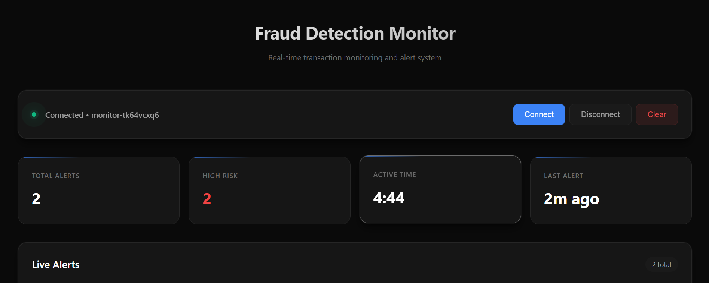
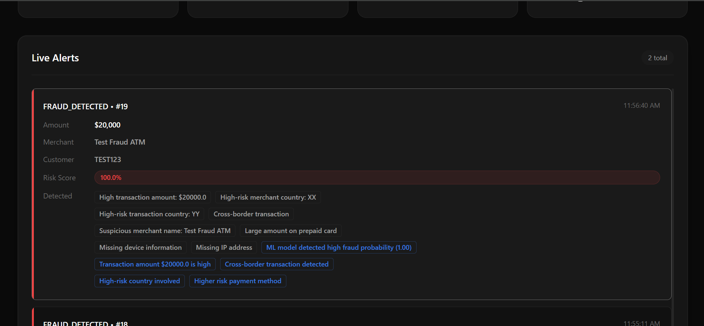

# Fraud Detection System

A production-ready enterprise fraud detection system with real-time streaming, machine learning, and instant alerts.

##  Features

- **Hybrid Fraud Detection**: Combines rule-based logic with ML (Random Forest) for accurate fraud detection
- **Real-time Processing**: Apache Kafka integration for high-throughput stream processing
- **Instant Alerts**: WebSocket-based real-time notifications for high-risk transactions
- **Dual Processing Modes**: Synchronous (low-latency) and asynchronous (high-throughput) transaction processing
- **Explainable AI**: Detailed fraud reasons for every risk assessment
- **RESTful API**: Comprehensive endpoints with automatic documentation

##  Tech Stack

- **Backend**: FastAPI, Python 3.11+
- **Database**: PostgreSQL
- **Streaming**: Apache Kafka
- **ML**: scikit-learn, Random Forest
- **Real-time**: WebSockets
- **Container**: Docker (for Kafka)

##  Prerequisites

- Python 3.11+
- PostgreSQL
- Docker & Docker Compose
- Git

##  Installation

1. **Clone the repository**
   ```bash
   git clone <repository-url>
   cd fraud-detection-system
   ```

2. **Create virtual environment**
   ```bash
   python -m venv venv
   # Windows
   .\venv\Scripts\activate
   # Linux/Mac
   source venv/bin/activate
   ```

3. **Install dependencies**
   ```bash
   pip install -r requirements.txt
   ```

4. **Set up environment variables**
   ```bash
   # Copy .env.example to .env and update values
   cp .env.example .env
   ```

5. **Start Kafka**
   ```bash
   docker-compose -f docker-compose-kafka.yml up -d
   ```

6. **Create Kafka topics**
   ```bash
   cd scripts
   python setup_kafka_topics.py
   cd ..
   ```

7. **Set up database**
   ```bash
   # Create database
   python scripts/create_db.py
   ```

8. **Train ML model**
   ```bash
   python scripts/train_ml_model.py
   ```

##  Running the Application

1. **Start the server**
   ```bash
   python run.py
   ```

2. **Open WebSocket monitor**
   - Open `test_websocket_client.html` in your browser

3. **Access API documentation**
   - http://localhost:8000/docs

## 📡 API Endpoints

### Transaction Processing
- `POST /api/v1/transactions` - Process transaction (direct mode)
- `POST /api/v1/transactions?stream_mode=true` - Process via Kafka
- `GET /api/v1/transactions/{id}` - Get transaction details
- `POST /api/v1/transactions/analyze` - Analyze without saving

### System Status
- `GET /api/v1/ml-model/status` - ML model status
- `GET /api/v1/streaming/status` - Kafka streaming status

### WebSocket
- `WS /ws/{client_id}` - Real-time fraud alerts

##  Usage Examples

### Submit a Transaction (Streaming Mode)
```bash
curl -X POST "http://localhost:8000/api/v1/transactions?stream_mode=true" \
  -H "Content-Type: application/json" \
  -d '{
    "amount": 5000,
    "transaction_type": "purchase",
    "merchant_name": "Electronics Store",
    "merchant_category": "Electronics",
    "merchant_country": "US",
    "customer_id": "CUST123",
    "payment_method": "credit_card",
    "transaction_country": "US"
  }'
```

##  Architecture

```
┌─────────────┐     ┌─────────────┐     ┌─────────────┐
│   Client    │────▶│   FastAPI   │────▶│    Kafka    │
│  (Browser)  │     │   Server    │     │   Broker    │
└─────────────┘     └──────┬──────┘     └──────┬──────┘
       ▲                   │                    │
       │                   ▼                    ▼
       │            ┌─────────────┐     ┌─────────────┐
       │            │  ML Model   │     │  Consumer   │
       │            │  + Rules    │     │  Service    │
       │            └─────────────┘     └──────┬──────┘
       │                                        │
       │                                        ▼
┌─────────────┐                         ┌─────────────┐
│  WebSocket  │◀────────────────────────│ PostgreSQL  │
│   Alerts    │                         │  Database   │
└─────────────┘                         └─────────────┘
```

## 🔍 Monitoring

- **Kafka UI**: http://localhost:8080
- **API Docs**: http://localhost:8000/docs
- **WebSocket Monitor**: Open `test_websocket_client.html`

##  Fraud Detection Logic

The system combines:
- **Rule-based checks**: Amount thresholds, geo-location, merchant categories
- **ML predictions**: Random Forest model trained on transaction patterns
- **Risk scoring**: 0-1 scale with weighted combination (40% rules + 60% ML)

## Screenshots





## Accessing the Monitor

After starting the server, access the fraud detection monitor at:
- http://localhost:8000/static/monitor.html
- Or use the redirect: http://localhost:8000/monitor